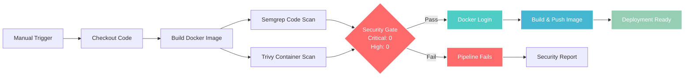

# Hojhon Portfolio Site

A secure, containerized portfolio website with automated CI/CD pipeline featuring security scanning and vulnerability management.

## 🚀 CI/CD Pipeline

This repository uses GitHub Actions for automated build, security scanning, and deployment:

### Workflow: Build, Scan & Push
**Trigger:** Manual dispatch (`workflow_dispatch`)  
**File:** `.github/workflows/build-scan-push.yml`

#### Pipeline Stages:
1. **Build** - Creates Docker image with embedded Formspree configuration
2. **Code Scan** - Semgrep static analysis for code vulnerabilities  
3. **Container Scan** - Trivy security scan for container vulnerabilities
4. **Security Evaluation** - Fails pipeline on critical/high vulnerabilities
5. **Push** - Pushes secure images to Docker registry (only if scans pass)

### Workflow Diagram



#### Security Gate Details:
- **Pass Criteria:** 0 Critical + 0 High vulnerabilities
- **Fail Criteria:** Any Critical or High vulnerabilities detected  
- **Reporting:** Detailed scan results in GitHub Actions summary

#### Security Thresholds:
- **Critical vulnerabilities:** `0` (fails pipeline)
- **High vulnerabilities:** `0` (fails pipeline)  
- **Medium/Low:** Allowed (with warnings)

### Required GitHub Secrets
Configure these in your repository settings under **Settings > Secrets > Actions**:

| Secret | Description | Example |
|--------|-------------|---------|
| `DOCKER_REGISTRY` | Docker registry URL | `docker.io` |
| `DOCKER_REPOSITORY` | Full repository path | `pxpucho/hojhon-site` |
| `DOCKER_USERNAME` | Registry username | `pxpucho` |
| `DOCKER_PASSWORD` | Registry access token | `dckr_pat_xxx...` |
| `FORMSPREE_FORM_ID` | Contact form endpoint ID | `xanpozrj` |

### Environment Configuration
The pipeline uses the **`hojhon-site`** GitHub Environment for secure secret management.

## 🏗️ Architecture

### Multi-Stage Docker Build
- **Stage 1:** Build preparation with Formspree URL injection
- **Stage 2:** Production nginx:alpine3.20 with security hardening
- **Security Features:**
  - Non-root user execution (nginx-app:1001)
  - Non-privileged port (8080)
  - Updated packages with vulnerability patches
  - Custom nginx configuration for security headers

### Runtime Configuration
The contact form is configured at **build time** using the `FORMSPREE_FORM_ID` secret, eliminating the need for runtime environment variables and keeping sensitive data out of source control.

## 🔧 Local Development

### Pull and Run
```bash
# Pull the latest secure image
docker pull docker.io/pxpucho/hojhon-site:latest

# Run locally
docker run --rm -p 8080:8080 docker.io/pxpucho/hojhon-site:latest

# Access the site
open http://localhost:8080
```

### Build Locally
```bash
# Build with Formspree configuration
docker build --build-arg FORMSPREE_FORM_ID=your_form_id -t hojhon-site:local .

# Run local build
docker run --rm -p 8080:8080 hojhon-site:local
```

## 🛡️ Security Features

- **Vulnerability Scanning:** Trivy container security scanning
- **Code Analysis:** Semgrep static code analysis  
- **Base Image:** Regularly updated Alpine Linux with security patches
- **Container Hardening:** Non-root execution, minimal attack surface
- **Secret Management:** Build-time injection prevents runtime secret exposure

## 📈 Monitoring

The pipeline generates detailed security reports and fails fast on security violations:
- **Build Summary:** Security scan results in GitHub Actions summary
- **Vulnerability Reports:** Detailed findings for any detected issues
- **Deployment Gates:** Automatic blocking of vulnerable images

## 🚀 Future Enhancements

### GitOps Integration
Ready for ArgoCD integration with:
- Kubernetes manifests
- Automated image tag updates  
- GitOps deployment workflows
- Environment promotion pipelines

### Advanced Security
- Container image signing
- SBOM (Software Bill of Materials) generation
- Runtime security monitoring
- Compliance reporting
